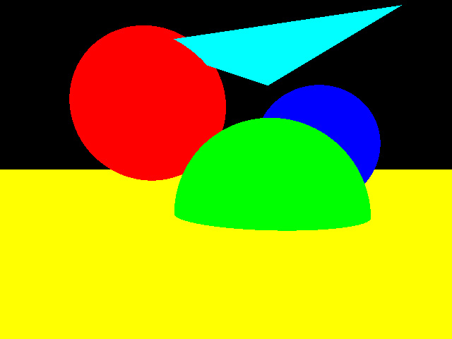
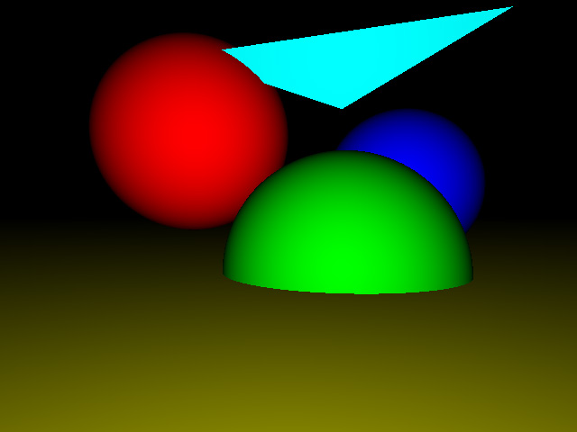
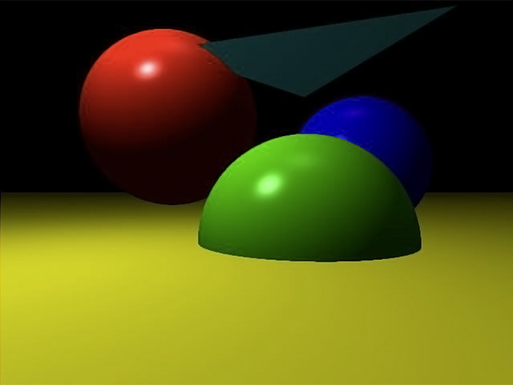
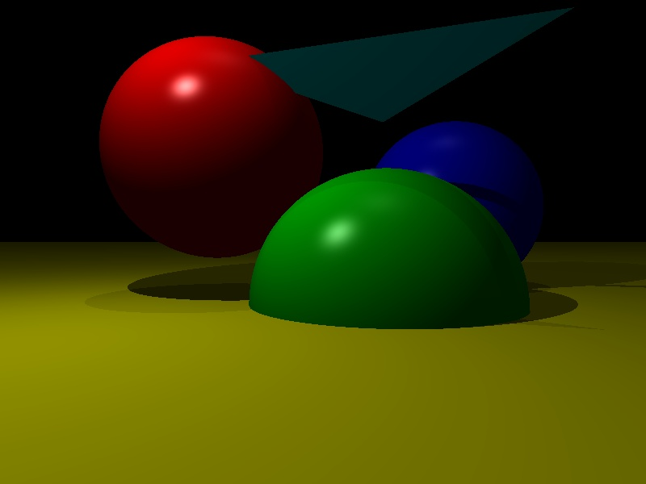
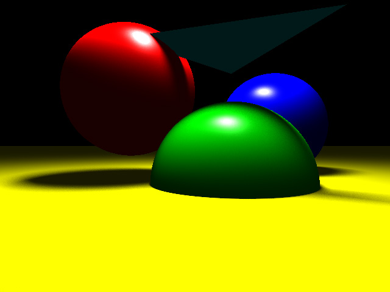

# Practical Assignment 2
Please put your name (or names if you work in a group) here:  
**Name**: .......
## Problem 2.2
### Encapsulate camera and primitives from main application logic (Points 5)
1. Fork the current repository
2. Study the new framework-code of 
    - IShader.h, ShaderFlat.h, ShaderEyeLight.h, ShaderPhong.h
    - ILight.h, LightPoint.h, LightArea.h 
    - Scene.h and main.cpp
3. A pointer ```CPrim* hit``` is now contained in your ```Ray``` structure. After a ray has been successfully intersected with a primitive, store the primitive’s address in ```hit``` (if the hit ditance is smaller than ```ray.t```).
4. In the class ```CScene``` you find a method ```void Add(const std::shared_ptr<CPrim> pPrim)```. Change your code accordingly using the appropriate vector defined in the class.
5. Rather then intersecting each primitive in the main function we will now use the ```bool Intersect(Ray& ray) const``` method of the ```Scene``` class. After modification the method should iterate over all primitives, intersect them and return true or false depending on if we had a valid hit with the scene data or not.
6. The loop of main.cpp calls the ```CScene::RayTrace(Ray& ray)``` method. This method should call ```bool Intersect(Ray& ray) ``` and depending on a hit or not return a white or black color.

## Problem 2.3
### The Surface-Shader Concept (Points 10 + 10)
A _surface-shader_ is a small program that is assigned to a primitive and is responsible for computing the color of each ray hitting this primitive. For example, a _flat shader_ might just return a constant color for a primitive, whereas another shader might compute more complex effects such as lighting, shadows, or texturing.

In this exercise, you will add some missing parts of the given basic shader framework to your ray tracer and implement two simple shaders:
1. Implement a simple flat shader. Proceed as follows:
    - The shader class has a pure virtual function ```Vec3f IShader::Shade(Ray& ray)``` , which has to be implemented in all derived shaders.
    - Implement the ```CShaderFlat::Shade(const Ray& ray)``` method. The method should just return the color passed in the constructor of ```CShaderFlat```.
    - Each primitive has a pointer ```std::shared_ptr<IShader> m_pShader```, which you can obtain via ```IShader::getShader()``` function in the new framework and a corresponding modified Constructor definition. Adjust the Constructor code appropriate. For example, our red sphere could be initialized using ```CSphere s1(Vec3f(-2.0f, 1.7f, 0), 2, std::make_shared<CShaderFlat>(RGB(1, 0, 0)));```. As we will see later some shaders need access to the scene data (_e.g_ for light or shadow calculations), this is why these shaders gets a reference to the scene objects (_e.g._ ```CShaderPhong```).
    - Finally, if, for instance, the primitive intersected by a ray has been stored in ```CPrim* hit```, the appropriate color can then be computed by calling ```hit->getShader()->Shade(ray)```; Change your code in ```CScene::RayTrace(Ray& ray)``` such that not black or white is returned but the color from the primitive with the closest hit or the background color if a ray does not hit a primitive.
2. Implement the ```CShaderEyelight::Shade(const Ray& ray)``` method in the eye light shader, which uses the angle between the incoming ray and the surface normal at the hit point to achieve a better impression of the actual primitive’s shape. The resulting color should be calculated according to: 
_result_ = |cos(_theta_)|·_color_
where _theta_ is the angle between the primitive surface normal and the ray direction. As the shader now needs to know some information about the primitive (_i.e._ the surface normal), some modifications are necessary:
    - Implement the ```Vec3f CPrim::GetNormal(const Ray& ray)``` method in all classes derived from ```CPrim```. ```GetNormal(const Ray& ray)``` should return the normalized normal of the primitive. The ray parameter passed to ```GetNormal(const Ray& ray)``` should be a ray that has been successfully intersected before, so you can assume that the intersection stored in this ray corresponds to the actual primitive. For example, ray.org + ray.t * ray.dir should be a point on the primitive.
    - Implement the shading function ```CShaderEyelight::Shade(const Ray& ray)``` using ```ray.hit->GetNormal(ray)``` to retrieve the surface normal of the primitive. With the surface normal the above given formula can be applied. If the test scene specified in main.cpp is rendered with these two shaders it should look like:
    
 

## Problem 2.4
### Phong Shading and Point Light sources (Points 30)
In the last exercise we implemented two simple surface shaders, which do not take light sources into account. A more advanced surface shading concept, the _phong shading model_, utilizes light sources to increase the rendering realism and give objects a plastic like appearance. Before we can implement the ```CShaderPhong::Shade(const Ray& ray)``` method in ShaderPhong.h we have to implement a simple light source.
1. Implement a point light. Proceed as follows:
    - Study the base interface class ```ILight```. Each light source which we will derive from it has to implement an ```ILight::Illuminate(Ray& ray)``` method.
    - Implement the ```CScene::Add(std::shared_ptr<ILight> pLight)``` method.
    - Implement the ```CLightPoint::Illuminate(Ray& ray)``` method. The method should calculate the light intensity, as described in the lecture, which hits the surface point from the light source as well as the direction vector from the surface point to the light source. The direction vector will be later used for shadow computations.
2. Implement the _phong illumination model_
    - The value _L<sub>r</sub>_ returned by ```CShaderPhong::Illuminate(Ray& ray)``` should be calculated according to:
    
    _L<sub>r</sub>_ = _k<sub>a</sub>c<sub>a</sub>L<sub>a</sub>_ + _k<sub>d</sub>c<sub>d</sub>_ Σ<sub>_l=0_</sub><sup>_n-1_</sup> _L<sub>l</sub>_(**I**<sub>_l_</sub>·**N**)+ _k<sub>s</sub>c<sub>s</sub>_ Σ<sub>_l=0_</sub><sup>_n-1_</sup> _L<sub>l</sub>_(**I**_<sub>l</sub>_·**R**)<sup>_k<sub>e</sub>_</sup>
    
    _c<sub>a</sub>_: Ambient color   
    _c<sub>d</sub>_: Diffuse color  
    _c<sub>s</sub>_: Specular color (Use _c<sub>s</sub>_ = (1, 1, 1) for white highlights)  
    
    _k<sub>a</sub>_: Ambient coefficient  
    _k<sub>d</sub>_: Diffuse coefficient  
    _k<sub>s</sub>_: Specular coefficient  
    _k<sub>e</sub>_: Exponent (_shine_ parameter)  
    
    _L<sub>a</sub>_: Ambient radiance  
    _L<sub>l</sub>_: Radiance arriving from light source _l_  
    
    **I**<sub>_l_</sub>: Direction to light source _l_  
    **N**: Shading normal  
    **R**: Reflected incident ray direction (must point away from the surface)
    
    _n_: Number of lights sources
    
### Notes:
- Sometimes an incident ray may hit the backside of a surface (_i.e._ the shading normal points to the other side.) Then, just turn the shading normal around to face forward.
- Only consider light sources that illuminate the primitive from its front-side (_i.e._ **I**<sub>_l_</sub>·**N** > 0).
    
## Problem 2.5
### Shadows (Points 20)
To add more realism to the phong model we want now to incorporate shadows into it. Proceed as follows:
- Implement the method ```CScene::Occluded(Ray& ray)``` in the ```CScene``` class, which should check if something blocks the light.
- Modify ```CShaderPhong::Shade(const Ray& ray)``` to check for occlusion.
If everything is implemented correct your images should look like this:

 

## Problem 2.6
### Area Lights (Points 20)
As you have learned in the last exercise, shadows can add important visual information to an image. Until now we have only considered point lights. Point lights create _hard shadows_ because a point light can not be partly occluded and is either blocked or not. To render more realistic shadows we need amore advanced light source. _Area Lights_ are able to produce _soft shadows_ which are more natural. In this exercise we implement a ```CLightArea``` (in LightArea.h) which is defined by four points in space:
- Calculate the normal and the area of the LightArea in the constructor.
- Calculate the intensity as described in the lecture by generating a random sample position on the area light (using ```DirectGraphicalModels::random::U()``` function from random.h file and bi-linear interpolation).
- Add ```scene.Add(std::make_shared<CLightArea>(areaLightIntensity, Vec3f(-1.5f, 10, -1.5f), Vec3f(1.5f, 10, 1.5f), Vec3f(1.5f, 10, -1.5f), Vec3f(-1.5f, 10, 1.5f)));``` to main.cpp and remove the point lights.
- Render an image with 1000 shadow rays per pixel
If everything is implemented correct your images should look like this:


