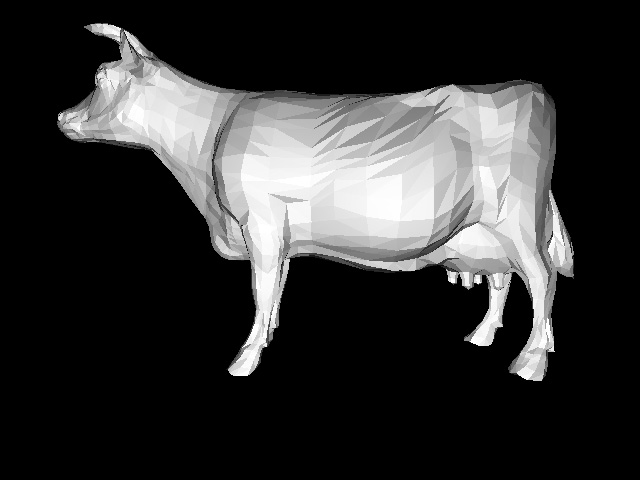

# Practical Assignment 3
**Name:** nhammad
## Problem 3.1
### OBJ Scene loader (Points 30)
Until now we have only hardcoded our scene descriptions in main.cpp. This is of course not practical. In the new framework, a method ```CScene::ParseOBJ()``` is added to the class ```CScene```, in order to load a scene-description from an obj-file. To make the method work proceed as follows:
1. Fork the current repository
2. Modify the README.md file in your fork and put your name (or names if you work in a group) above.
3. Have a look at the file cow.obj. Study how triangles are stored in the obj-format. The _v_ ’s indicate a single 3d-vertex position, and the _f_ ’s (faces) are indecies to 3 vertex numbers a triangle consits of (please note that the face indecies are starting with **1 and not 0**).
4. Implement the missing parts of the ParseOBJ-method.
Test your implementation with cow.obj. If your obj-importer works as expected you should see an image of a cow like this:



**Hint:** The obj file-format can be dumped out from various 3d-modelers. Nevertheless, the output might differ from modeler to modeler and there are also other tokens like _vn_ for vertex normals or _vt_ for texture coordinates. Check
[obj file format](https://www.cs.cmu.edu/~mbz/personal/graphics/obj.html) for a full description. 

## Problem 3.2
### Implementation of a kd-tree acceleration structure (Points 70)
So far, your own ray tracer implementation has used no acceleration structure for reducing the number of ray / primitive intersections. This was simple to implement and worked relatively good. Unfortunately, this, of course, is not practical for larger scenes as you have noticed in the last exercise with the cow. As such, you need a data structure to speed up the process of finding the first hit of a ray with the primitives. In recent years the kd-tree proved to be a useful acceleration data structure for minimizing ray-intersection tests. To implement your kd-tree proceed as follows:
1. A new class ```CBoundingBox``` is now in the framwork which contains two ```Vec3f```’s for the ```min, max``` - fields of the bounding box.
2. Furthermore the class has a method ```void CBoundingBox::extend(Vec3f a)```. Implement the following functionality: If _a_ is not inside a bounding box _b_, ```b.bxtend(a)``` should extend the bounding box until it also includes _a_. **Tip:** Initialize your box with an ’empty box’ (_min = +infinity, max = −infinity_).
3. The method ```virtual CBoundingBox CPrim::calcBounds() = 0``` has to be implemented in every class derived from ```CPrim```.
4. Most acceleration structures require to clip the ray with the bounding box of the scene, as the origin might otherwise be outside the scene bounds. For clipping a ray with the bounding box of a scene, you can best use the slabs algorithm and implement it in ```void CBoundingBox::clip(const Ray& ray, float& t0, float& t1)```.
5. You will need a method to decide whether a primitive is contained in a given voxel or not. Therefore, a method ```bool CPrim::inVoxel(const CBoundingBox& box)``` is added to the class ```CPrim```. Implement the method. For simplicity, just check the primitives bounding box for overlap with the box. Therefore, implement the method ```bool CBoundingBox::overlaps(const CBoundingBox& box)``` in your ```CBoundingBox``` class. Keep in mind that floating-point numbers have limited accuracy!
6. Implement the method ```CBoundingBox CScene::CalcBounds()```, which should calculate the bounding box of the scene.
7. Implement the method ```std::shared_ptr<CBSPNode> CBSPTree::BuildTree(const CBoundingBox& box, const std::vector<std::shared_ptr<CPrim>>& vpPrims, int depth)``` of the class ```CBSPTree```. As soon as you have reached a maximum depth (_e.g._ 20), or you have less then a minimum number of primitives (_e.g._ 3 or 4), stop subdividing and generate a voxel. Otherweise, split your voxel in the middle (in the maximum dimension), sort your current voxels primitives into two vector left and right, and recursively call BuildTree with the respective voxels and vector for left and right. Start subdivision with a list of all primitives, the total scene bounds, and an initial
recursion depth of 0.  
**Note:** BSP-tree is a special case of the KD-tree (for the 3-dimensional case, _e.g_ K=3). A very good implementation of the KD-tree may be found in the DGM-library repository: [KDTree.h](https://github.com/Project-10/DGM/blob/master/modules/DGM/KDTree.h) [KDTree.cpp](https://github.com/Project-10/DGM/blob/master/modules/DGM/KDTree.cpp) [KDNode.h](https://github.com/Project-10/DGM/blob/master/modules/DGM/KDNode.h) [KDNode.cpp](https://github.com/Project-10/DGM/blob/master/modules/DGM/KDNode.cpp). 
8. For traversal, use a simple, recursive algorithm, see _Ray Tracing with the BSP tree, by Kelvin Sung and Peter Shirley, in Graphics Gems III_ or read the chapter 7.2 in the [thesis of Dr. Ingo Wald](http://www.sci.utah.edu/~wald/PhD/wald_phd.pdf).

Instead of optimizing too much, rather concentrate on a stable, bug-free implementation.
