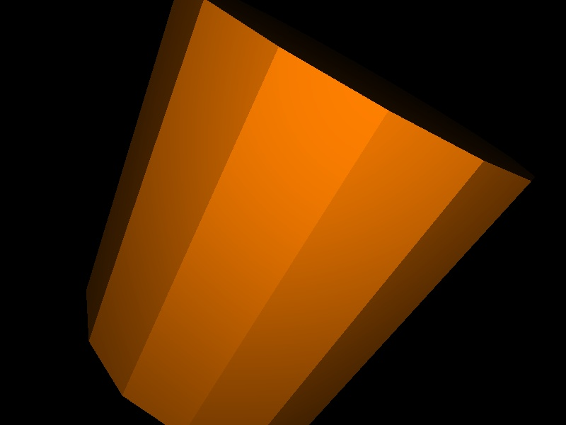
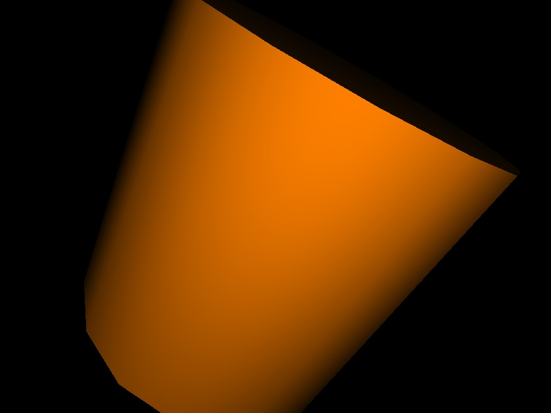
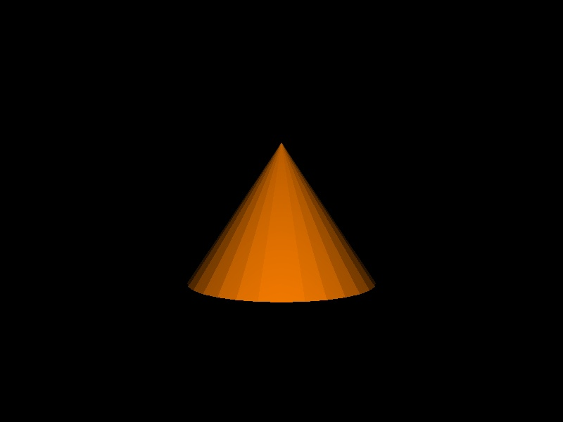
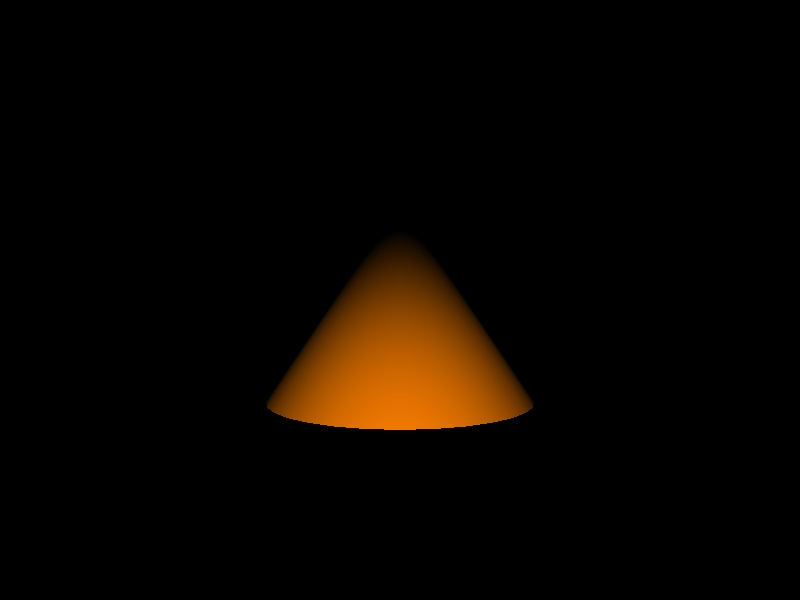
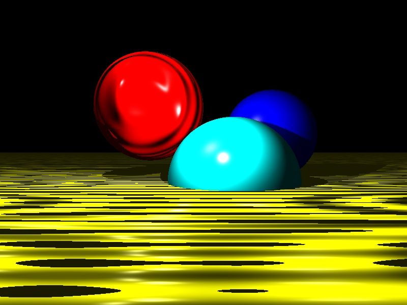
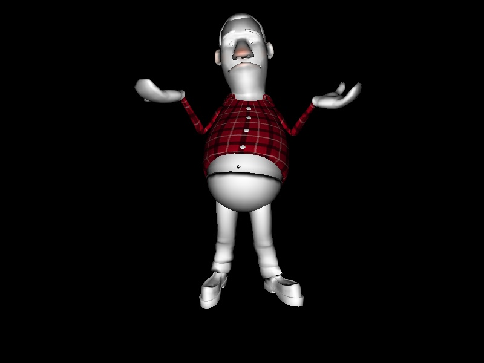
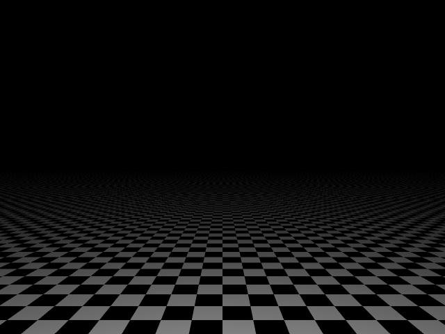
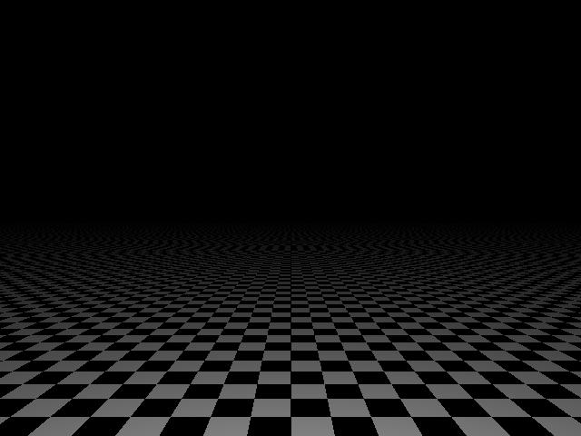
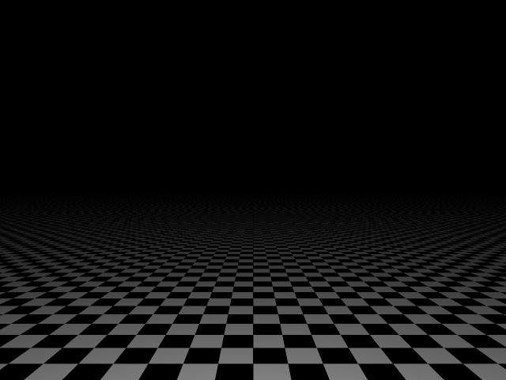

# Practical Assignment 4
**Name:** nhammad
## Problem 4.1 
### Vertex Normals (Points 20)
Rather then storing a single _geometry normal_ for a triangle, it is often useful to store at each ```vertex``` a corresponding _vertex normal_. The advantage is that if we have a hit point on a triangle, the shading normal can be smoothly interpolated between the vertex normals. If neighboring triangles share the same vertex normals, a smooth appearance can be generated over non-smooth tesselated geometry.  
Proceed as follows:
1. Fork the current repository.
2. Modify the README.md file in your fork and put your name (or names if you work in a group) above.
3. Extend ```CScene::ParseOBJ()``` to also support vertex normals. Take a look at the included .obj files in the data folder.
4. Turn off BSP-support by disabling the flag `ENABLE_BSP` in types.h file or in cmake-gui.exe application. 
5. Your ray class is extended with two additional ```float``` values calles ```Ray::u``` and ```Ray::v```.
6. In ```bool CPrimTriangle::Intersect(Ray& ray)```, store the computed barycentric coordinates into ```Ray::u``` and ```Ray::v```.  
Note: As long as your other classes (_e.g._ ```CPrimSphere```) don’t need local surface coordinates, there is no need to compute them yet.
7. In the framework is a new class ```CPrimTriangleSmooth``` which stores the vertex normals (```na```, ```nb``` and ```nc```) additionaly to the original vertex positions.
8. In ```Vec3f CPrimTriangleSmooth::GetNormal(const Ray& ray)``` use the _u_/_v_ coordinates of the hitpoint to interpolate between the vertex normals.  
Note: Interpolating normalized vectors will not return a normalized vector! Make sure to normalize your interpolated normal!
9. Test your implementation with cylinder16.obj and cone32.obj using the appropriate camera you can choose in Scene.h. Compare the difference between the regular and the smooth triangles.  
If everything is correct your images should look like this:  
  


## Problem 4.2
### Procedual Bump Mapping (Points 20)
In the last exercise you have learned that the appearence of a surface can be changed by using a modified _surface normal_. In this exercise we will implement a technique called _bump mapping_ which bumps the surface normal sideways such that a surface has the impression of beeing bumped. This often allows to generate the appearance of highly complex surface with only very few primitives. In order to do this, three parameters have to be known for each surface point:
1. The original surface normal _N_.
2. A local coordinate frame for this surface point. Though any coordinate frame can be used (as long as it is consistent), the usual way is to use the surface derivates in _u_ and _v_ direction, called _dPdu_ and _dPdv_.
3. The amount _delta_u_, _delta_v_ of deviation along these tangent vectors. The deviation is usually either read from a texture, or is computed procedurally. The final normal during shading (also for reflections) is then _N' = Normalized(N + delta_u * dPdu + delta_v * dPdv)_.  

In this exercise, you will implement a very basic version of this:
- As surface derivatives, use _dPdu = (1, 0, 0)_ and dPdv = _(0, 0, 1)_.
- For the amount of deviation, use a simple procedural approach, by computing _delta_u = 0.5 * cos(3 * H_x * sin(H_z))_, _delta_v = 0.5 * sin(13 * H_z)_. _H_ denotes the hit point of the ray with the surface.  

For your implementation, proceed as follows:
- Implement the Shade-method in ShaderPhongBumpMapped.h by first copying the ```Shade()```-method from the basic phong shader and then modifying the normal at the beginning of the ```Shade()``` function, following the guidlines given above.
If your shader work correct you should get an image like this using the scene description in main.cpp:  


**Tip:** The concept for a local coordinate frame will also be necessary for many other shading concepts, like _e.g._ procedural shading. For the exam, you will probably need such a concept, as the above hardcoded version will not be powerful enough.  
As getting the correct surface derivates can be somewhat complicated, there is also a simpler (though not as powerful) way of getting an orthonormal surface coordinate frame from the surface normal, which is similar to our way of generating the orthonormal camera coordinate frame from the camera direction. For a detailed discussion about surface derivatives you can also read Matt Pharr’s book _Physically Based Rendering_.

## Problem 4.3
### Texturing (Points 30)
Until now we have only used one color per object. Nevertheless, in reality, _e.g._ in games, objects are very often colorful because of the usage of textures. This is also a way of making a surface look more geometrically complex. Usually, textures are used by storing _texture coordinates_ at the vertices of each triangles, and interpolating those to find the correct texel that has to be used for a surface point.
1. Turn BSP-support on
2. In the framework is a new class ```CPrimTriangleSmoothTextured``` (derived from ```CPrimTriangleSmooth```), that additionally has the three fields ```Vec2f ta, tb, tc```, which correspond to the texture coordinates at vertex ```a```, ```b```, and ```c```, respectively. Here we will use ```Vec2f```’s to store the texture coordinates (not ```Vec3f```), because they require only 2 coordinates (barycentric coordinates). Add support for texture coordinates to your parser (```CScene::ParseOBJ()```).
3. Implemet the method ```Vec2f CPrimTriangleSmoothTextured::getUV(const Ray& ray) const``` which is now a virtual method in your primitive base class. In ```CPrimTriangleSmoothTextured```, implement this function to return the _x_ and _y_ coordinates of the interpolated vertex texture coordinates. (For other primitives, just ignore it for now, we’ll only use texture-shaders with triangles for now).
4. Implement the ```CShaderEyelightTextured::Shade()``` method to use the texture coordinates returned by ```getUV()``` and combine the texel color with the calculated eyelight color using the vector product. 

Test your implementation on barney.obj with barney.bmp. If everything is correct your image should look like this:


## Problem 4.4
### Supersampling (Points 10 + 10 + 10)
A pixel actually corresponds to a square area. Currently you are sampling the pixels only at their center, which lead to aliasing. As you have learned in the lecture, the most simple way for removing aliasing artifacts from your image is _supersampling_, _i.e._ to shoot more than one ray per pixels. The three most frequently used supersampling strategies are:  

**Regular Sampling:** The Pixel is subdivided into _n = m x m_ equally sized regions, which are sampled in the middle:  
_((i+0.5)/m, (j+0.5)/n)_ for _i,j=[0 .. m-1]_

**Random Sampling:** The Pixel is sampled by _n_ randomly placed samples _e<sub>i</sub> in [0; 1)_  
_(e<sub>i,1</sub>,e<sub>i,2</sub>)_ for _i=[0 .. n-1]_

**Stratified Sampling:** Stratified sampling is a combination of regular and random sampling. One sample is randomly placed in each of the _n = m x m_ regions with _e<sub>i,1</sub>,e<sub>i,2</sub> in [0, 1)_  
_((i+e<sub>i</sub>)/m, (j+e<sub>j</sub>)/m)_ for _i,j=[0 .. m-1]_

In this exercise your task is to implement these sampling strategies:
- In the framework you can find an abstract base class ```CSampleGenerator``` with one single virtual method ```void SampleGenerator::GetSamples(int n, float *u, float *v, float *weight)```, which is supposed to works as follows: _n_ is the number of samples to be generated for a pixel. One sample consists of two coordinates (_u_, _v_) that specify a position on a pixel. The _n_ samples generated are then to be returned in the _u_ and _v_ arrays, where (_u_, _v_) should be in the domain _[0 .. 1) X [0 .. 1)_. The weights for the individual samples should sum up to 1, here just use uniform weights with ```weight[i]=1.0f/n```.
- In your main loop, produce _n_ samples, and fire _n_ rays through the pixel at the respective sample position. The resulting color values must be weighted by ```weight[i]``` and summed up, which yields the final pixel result.
- Implement the ```getSamples()``` method in SampleGeneratorRegular.h, SampleGeneratorRandom.h, and SampleGeneratorStratified.h which are derived classes from ```CSampleGenerator```.
Use ground.obj and cb.bmp to render your image with 4 samples and compare them to the following images: (regular) (random) (stratified)


